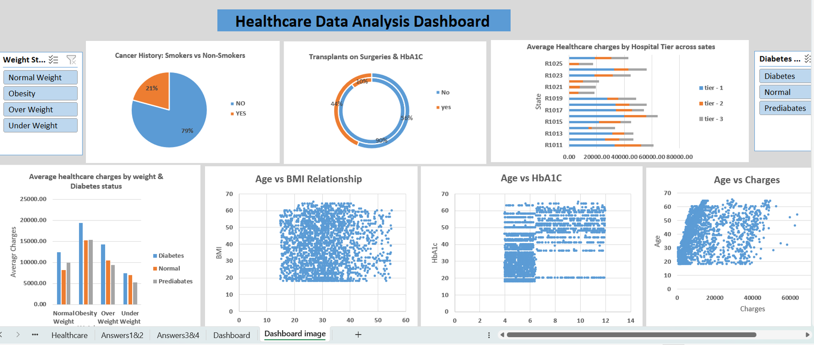

# Healthcare Data Analysis using Microsoft Excel

## Project Overview

This project demonstrates a healthcare data analysis workflow using Microsoft Excel. The analysis focuses on cleaning and transforming healthcare-related data, solving defined business problems, performing data analysis using Excel functions and Pivot Tables, and presenting insights through a dashboard.

The project follows a structured approach:

**Business Problems → Data Preparation → Analysis → Business Solutions → Dashboard**

## Objectives

- Clean and prepare healthcare data for analysis
- Transform and standardize data using Excel
- Combine information from multiple data tables
- Analyze healthcare-related business questions
- Use Excel formulas and Pivot Tables to generate insights
- Present key findings through a dashboard

## Tools & Technologies

- Microsoft Excel
- Excel Formulas
- VLOOKUP
- IF / Nested IF
- DATEDIF
- Text to Columns
- Data Cleaning & Transformation
- Pivot Tables
- Data Analysis
- Data Visualization
- Dashboard Development

## Dataset

The project uses healthcare-related data organized across multiple worksheets, including:

- Customer information
- Medical examination details
- Hospitalisation details
- Healthcare data

The prepared healthcare dataset is used for analysis and dashboard development.

## Project Structure

### 1. Healthcare

Contains the prepared healthcare dataset used for analysis.

### 2. Business Problems

Contains the business questions that guide the analysis.

### 3. Business Solutions 1 & 2

Contains the Excel-based analysis and solutions for the first two business problems using Pivot Tables and other Excel analysis techniques.

### 4. Business Solutions 3 & 4

Contains the analysis and solutions for the remaining business problems.

### 5. Dashboard

Presents the key findings from the analysis in a visual format.

## Data Preparation & Analysis

The project includes several data preparation and analysis techniques:

- Data cleaning
- Data standardization
- Data transformation
- Lookup and data integration
- Conditional logic
- Date-based calculations
- Pivot Table analysis
- Aggregation and summary analysis
- Business insight generation

## Dashboard Preview

## Key Skills Demonstrated

- Data Cleaning
- Data Transformation
- Excel Functions
- Data Integration
- Pivot Table Analysis
- Business Problem Solving
- Data Visualization
- Dashboard Development
- Analytical Thinking

## Project Outcome

This project demonstrates the ability to take structured healthcare data, prepare it for analysis, investigate business questions, generate analytical solutions, and communicate findings through an Excel dashboard.

## Files

- `Healthcare_Data_Analysis_Excel.xlsx` – Complete Excel workbook containing the data, business problems, analysis, solutions, and dashboard.
- `healthcare-dashboard.png` – Dashboard preview.

## Author

**Harishma G**

Aspiring Data Analyst | M.Sc. Mathematics

[LinkedIn](https://www.linkedin.com/in/harishma-g) | [GitHub](https://github.com/harishma011)
